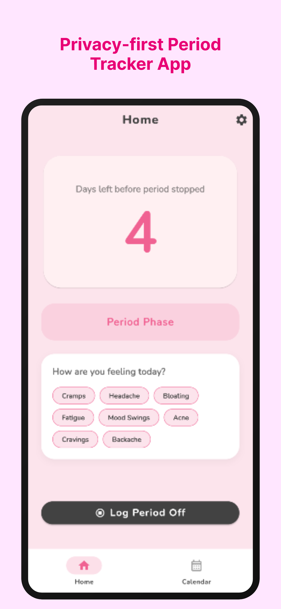
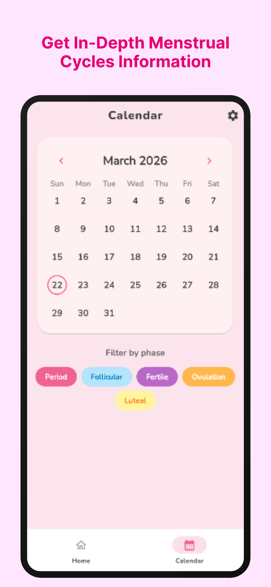
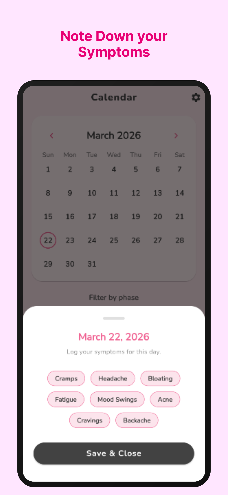
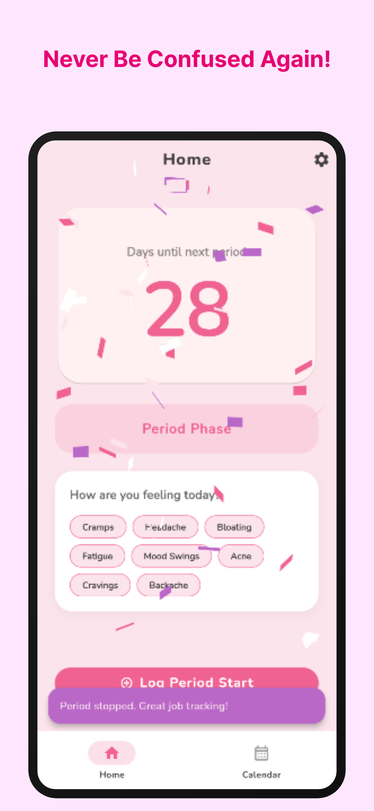
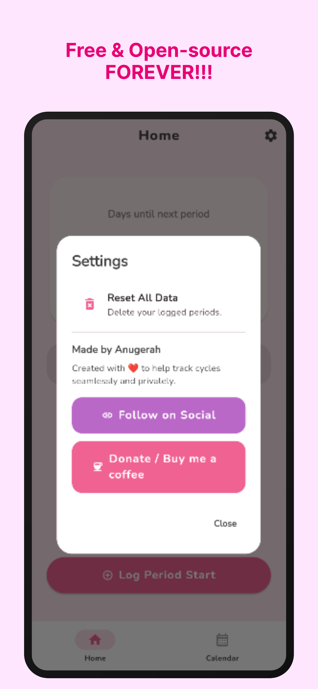

<h1 align="center">Swoo</h1>

🌸 Private Period Tracking App for Android 🌸

  

---

## 🌸 Swoo

**Swoo** is a simple and private period tracking app.

No account needed. No ads. No tracking.

Your personal data stays on your phone — not on the internet.

Safe, simple, and made for everyone.

---

## 📥 Download

👉 Get the latest version here:

➡️ https://github.com/nugehoodg/Swoo/releases

Download the APK and install it on your Android phone.

---

## 📱 Screenshots

  
    
    
    
    

---

## ✨ Features

🌸 Track menstrual cycle  
📅 Predict upcoming periods  
📝 Log symptoms and notes  
📊 View cycle history  
🎨 Clean and simple design  
📴 Works offline  
⚡ Lightweight and fast

---

## 🔒 Privacy First

Swoo respects your privacy.

❌ No account  
❌ No ads  
❌ No tracking  
❌ No data collection  
❌ No internet required

Your data stays with you.

---

## ❤️ Why Swoo?

Many apps collect personal information.

**Swoo does not.**

Made for people who want a simple and trustworthy period tracker.

---

## 🌍 Open Source

Anyone can view the code and help improve the app.

If you like Swoo, consider giving this repository a ⭐

---

🌸 Simple
🔒 Private
📱 Yours
